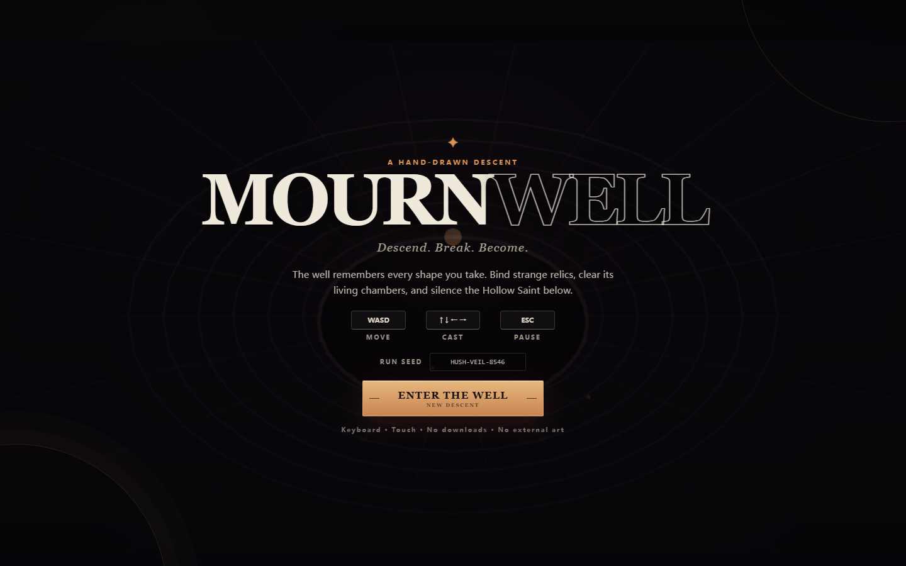
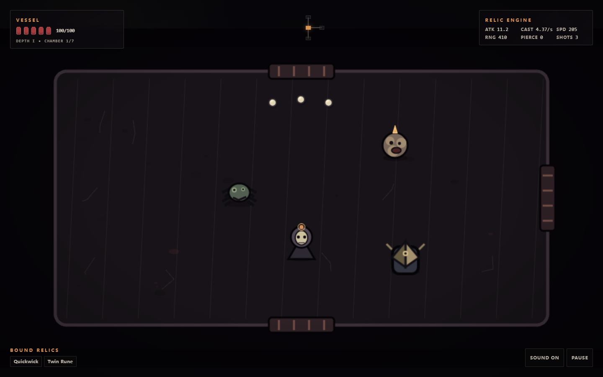
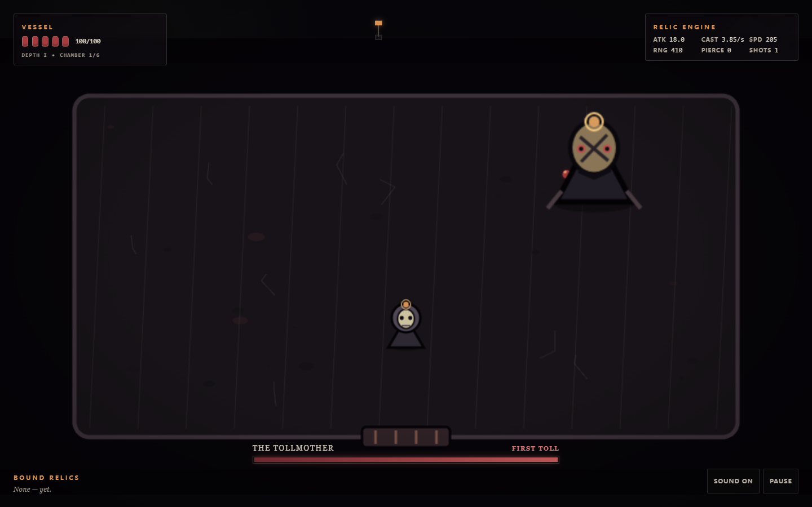
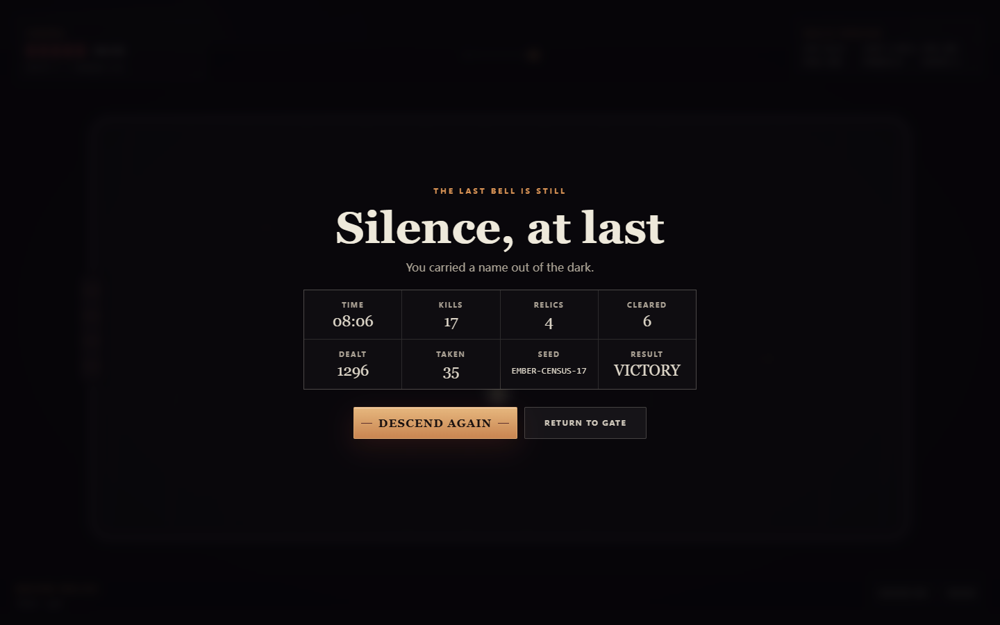
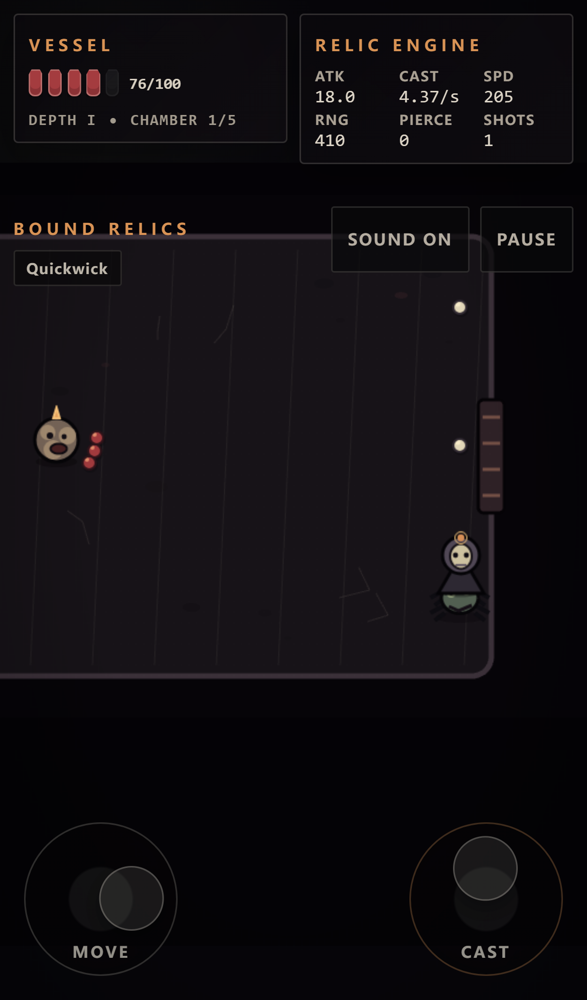
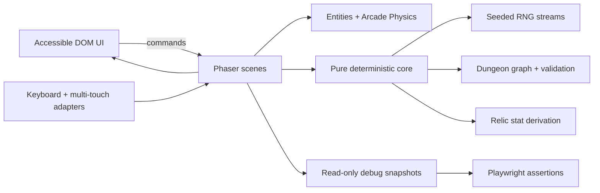

<div align="center">
  
  <h1>MOURNWELL</h1>
  <p><strong>Descend. Break. Become.</strong></p>
  <p>An original, code-drawn dark cartoon room-crawler for desktop and mobile.</p>

[](https://github.com/appleweiping/mournwell/actions/workflows/ci.yml)
[](https://appleweiping.github.io/mournwell/)
[](https://phaser.io/)
[](https://www.typescriptlang.org/)
[](#originality--asset-policy)
[](./LICENSE)
</div>



> 一款可直接在浏览器运行的原创暗黑卡通房间制 Roguelite：随机地牢、四向射击、差异化敌人、Boss、多点触控、可叠加遗物和完整胜负流程，所有图形与音效均由代码生成。

MOURNWELL is a focused 8–12 minute run built around readable four-direction combat, deterministic 5–8 room dungeons, stackable relics, and a three-phase final encounter. It borrows only genre-level ideas—room clearing, procedural layouts, and build synergies—while its world, cast, visuals, writing, numbers, UI, and generated assets are original.

## Why it feels complete

| Pillar                    | Shipped behavior                                                                                                                                                   |
| ------------------------- | ------------------------------------------------------------------------------------------------------------------------------------------------------------------ |
| **Responsive combat**     | WASD movement, held four-way casting, cadence-based cooldowns, recoil, hit flash, impact particles, camera shake, invulnerability frames                           |
| **Deterministic dungeon** | 5–8 connected chambers, bidirectional doors, farthest-leaf Boss room, treasure room, seeded replay, discovered-room minimap                                        |
| **Distinct enemy AI**     | Siltling pursues and lunges; Wickspitter kites and fires a telegraphed spread; Knellguard lines up armored charges; Tollmother changes pattern across three phases |
| **Buildcraft**            | Eight original relics alter attack, fire rate, speed, range, health, multishot, pierce, and homing; duplicates stack and update the live attribute panel           |
| **Complete run flow**     | Title → exploration → sealed combat → reward → Boss → victory, plus pause, death, restart, statistics, procedural audio, and local best-run data                   |
| **Desktop + mobile**      | Keyboard on desktop; simultaneous two-finger movement and casting joysticks on touch devices; responsive safe-area-aware HUD                                       |
| **Testable by design**    | Stable `window.__game` snapshot API; development-only deterministic fixtures; unit, property, and real Playwright input tests                                      |

## Demo gallery

<table>
  <tr>
    <td width="50%"></td>
    <td width="50%"></td>
  </tr>
  <tr>
    <td align="center"><strong>Readable room combat</strong><br/><sub>Three enemy silhouettes, open/locked doors, live relic stats</sub></td>
    <td align="center"><strong>The Tollmother</strong><br/><sub>Telegraphed, phase-based final encounter</sub></td>
  </tr>
  <tr>
    <td width="50%"></td>
    <td width="50%"></td>
  </tr>
  <tr>
    <td align="center"><strong>Complete run accounting</strong><br/><sub>Time, kills, relics, rooms, damage, seed, result</sub></td>
    <td align="center"><strong>True multi-touch</strong><br/><sub>Move and cast concurrently; release and cancellation are handled</sub></td>
  </tr>
</table>

## Quick start

Requirements: **Node.js 22+**, **npm 11.17.x**, and a modern Chromium, Firefox, or Safari browser. The exact npm line enforces the reviewed install-script allowlist.

```bash
git clone https://github.com/appleweiping/mournwell.git
cd mournwell
npm ci
npm run dev
```

Open `http://localhost:4173`. No server, account, API key, asset download, or environment file is required.

Production build:

```bash
npm run build
npm run preview
```

## Controls

| Context | Action            | Input                                      |
| ------- | ----------------- | ------------------------------------------ |
| Desktop | Move              | `W` `A` `S` `D`                            |
| Desktop | Cast continuously | Arrow keys `↑` `↓` `←` `→`                 |
| Desktop | Pause / resume    | `Esc` or `P`                               |
| Mobile  | Move              | Left virtual joystick                      |
| Mobile  | Aim + cast        | Right virtual joystick                     |
| Both    | Menus             | Native buttons with visible keyboard focus |

The casting stick snaps to the four authored directions. Both touch zones retain separate pointer IDs, so movement and casting work at the same time.

## Systems at a glance

### Dungeon rules

- A seeded generator produces exactly **5–8 grid-aligned rooms**.
- Every room is reachable and every connection is bidirectional.
- The Boss room is a farthest leaf at least three doors from the start.
- A distinct treasure room is always present.
- Combat seals every available exit; the final death opens all connected doors after a deliberate beat.
- Cleared and visited state persists for the run; the minimap reveals visited rooms and their immediate neighbors.
- The same seed reproduces layout, encounter composition, and reward rolls.

### Enemy roster

| Enemy              | Readable behavior                                               |
| ------------------ | --------------------------------------------------------------- |
| **Siltling**       | Wobbled pursuit, close-range lunge, recovery window             |
| **Wickspitter**    | Maintains range, strafes, glows before a three-shot fan         |
| **Knellguard**     | Armored front, alignment check, warning state, wall-stun charge |
| **The Tollmother** | Fan casts → radial casts + summons → fast radial/aimed pressure |

### Relic engine

Relic attributes are recomputed from base values and stack counts—never compounded from a previously mutated result—so repeated pickups remain deterministic and drift-free.

| Relic           | Primary effect                           |
| --------------- | ---------------------------------------- |
| Iron Lament     | Attack and projectile weight             |
| Quickwick       | Faster casting cadence with a hard floor |
| Longglass       | Range and projectile speed               |
| Mudrunner Soles | Movement speed with a cap                |
| Blackwax Knot   | Maximum resolve and immediate healing    |
| Twin Rune       | Three-shot, then five-shot casting mode  |
| Briar Eye       | Stacking pierce with post-hit falloff    |
| Compass Moth    | Bending projectiles with a turn-rate cap |

## Architecture



Pure TypeScript owns reproducible RNG, room topology, topology validation, and relic math. Phaser is the rendering/physics/input adapter. The DOM layer owns accessible menu, HUD, pause, results, and touch controls. See [Architecture](./docs/ARCHITECTURE.md) for lifecycle and invariants.

## Runtime observability

The standard build exposes a serializable, cloned, read-only snapshot:

```js
const state = window.__game.getSnapshot();

state.summary.hp;
state.summary.enemyCount;
state.summary.bulletCount;
state.summary.currentRoom;
state.summary.itemIds;
state.summary.attributes;
state.room.doorsOpen;
```

The contract also includes enemy HP/state, both projectile counts, room graph, inventory stacks, run metrics, and FPS. Mutating fixture controls exist only when running a development build with `?qa=1`; they are absent from production.

## Quality gates

```bash
npm ci
npx playwright install chromium
npm run test:all
npm run audit:prod
```

Current release evidence:

- **14/14 unit/property tests pass**, including 10,000 generated dungeons, 1,000 readable seed samples, and corrupted-save recovery.
- Every generated seed verifies room count, reachability, unique coordinates, reciprocal doors, and special-room constraints.
- Real Playwright input verifies movement, projectile creation, enemy damage/death, kill accounting, door unlock, pickup/stat mutation, death, victory, and simultaneous multi-touch.
- Console errors, page errors, and failed requests fail the browser suite.
- TypeScript strict mode and ESLint pass with zero warnings.
- Production build succeeds at roughly **358 KB gzip** (**350.1 KiB**), including the Phaser engine.
- Production dependency audit reports **0 known vulnerabilities**.

Full evidence and iteration history live in [Quality & Verification](./docs/QUALITY.md).

## Originality & asset policy

- All characters, enemies, relics, floors, UI ornament, particles, favicon, and effects are drawn at runtime with Phaser Graphics, Canvas, CSS, or SVG source code.
- All sound effects are synthesized at runtime with the Web Audio API.
- No original-game art, audio, fonts, text, names, or downloaded assets are included.
- The implementation studies genre mechanics and broad visual traits, then applies an original folk-horror identity: bell masks, archive chambers, stitched mantles, ash, wax, and silt.
- MOURNWELL is not affiliated with or endorsed by Edmund McMillen, Nicalis, or _The Binding of Isaac_.
- The working product name still requires jurisdiction-specific trademark and store-name clearance before a paid release.

The research method, Firecrawl result IDs, Context7 queries, and source links are documented in [Research & Design Evidence](./docs/RESEARCH.md).

## Repository map

```text
src/game/data/        Relic definitions and stat formulas
src/game/entities/    Player, enemy AI, and projectile adapters
src/game/scenes/      Boot, menu ambience, and run orchestration
src/game/systems/     RNG, dungeon, input, touch, audio, UI, save, debug
tests/                Pure unit and 10,000-seed property tests
e2e/                  Real keyboard/touch Playwright journeys
screenshots/          Deterministic demo captures generated by E2E
docs/                 Architecture, research, quality, operations
.github/              CI, CodeQL, Pages, dependency automation
```

## Commercial handoff notes

This repository is production-oriented, but “commercial-ready” is a process rather than a badge. Before monetization, complete trademark review, age/content ratings, store policies, device lab testing, localization, controller support, and a formal privacy assessment if telemetry is introduced. The current build collects **no analytics** and sends **no gameplay data**.

See [Operations](./docs/OPERATIONS.md), [Security Policy](./SECURITY.md), and [Contributing](./CONTRIBUTING.md).

## License

Code and original project assets are released under the [MIT License](./LICENSE). Phaser and EventEmitter3 copyright grants are reproduced in [Third-party notices](./THIRD_PARTY_NOTICES.md) and copied into every production artifact.
