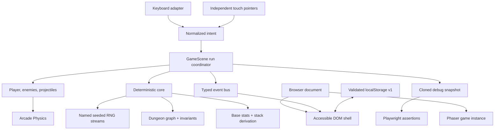

# Architecture

MOURNWELL is a static browser application. Phaser owns the real-time loop,
Arcade Physics, camera, and runtime drawing; strict TypeScript owns deterministic
rules; a small DOM shell owns accessible menus, HUD, results, and touch controls.
There is no application server.

## Runtime topology

## Lifecycle

1. `BootScene` creates every texture from Phaser Graphics/Canvas and prepares
   synthesized audio. Nothing is fetched from a game-asset CDN.
2. `MenuScene` renders title ambience while the DOM presents run and settings
   actions.
3. `GameScene` derives a dungeon and named RNG streams from the chosen seed,
   instantiates the current room, and drives combat.
4. Room entry restores run-owned state. A combat room seals connected exits
   until its final enemy dies; the room is then permanently cleared.
5. The scene emits typed HUD, toast, phase, result, and snapshot events. The DOM
   renders presentation but does not own combat truth.
6. Death or Boss completion freezes combat and emits a result snapshot. Only
   aggregate local best-run data persists beyond the run.

## Determinism boundaries

The deterministic core includes dungeon topology, encounter composition, reward
selection, and relic formulas. Random choices use a seed hash and forked streams,
so adding a cosmetic draw does not perturb topology. Wall-clock timing, browser
physics integration, particles, audio, and frame rate are intentionally outside
the replay guarantee.

Dungeon validation enforces:

- 5–8 unique grid coordinates;
- one connected component rooted at the start;
- reciprocal cardinal links with adjacent coordinates;
- exactly one start, treasure, and Boss room;
- a Boss on a farthest leaf at graph distance three or greater.

Relic stats are always recomputed from immutable base stats plus stack counts.
This prevents order-dependent floating-point drift and makes duplicate pickups
predictable.

## Input model

Desktop and touch adapters produce the same normalized move and four-direction
cast intent. Each virtual joystick owns a separate pointer ID. Moving one finger
cannot steal the shooting stick, and pointer cancellation clears only the owning
stick. Shooting is cadence-limited by game stats, not browser event frequency.

## Observability contract

`window.__game` is versioned with `apiVersion: 1`. `getSnapshot()` and `state`
return structured clones containing phase, seed, HP, attributes, room state,
dungeon graph, enemies, projectile counts, inventory, run counters, and runtime
metrics. Subscribers also receive clones.

Development builds opened with `?qa=1` add fixture controls for reset, spawn,
damage, room entry, item grant, and room clear. Vite compile-time replacement
removes this branch from production builds. Tests assert the production bridge
does not gain mutation authority.

## Failure containment

- Invalid or unavailable local storage falls back to a safe default and never
  blocks a run.
- Save fields are type/range checked and schema-versioned.
- Audio starts only after a user gesture and failure does not affect gameplay.
- Generated layouts fail validation before they enter scene state.
- Result transitions stop active intent and prevent post-run damage.
- Browser tests fail on page errors, console errors, and failed same-page
  requests in addition to visible outcomes.

## Extension seams

New enemies implement an authored state machine in `Enemy.ts`; new relics add a
definition and a pure derivation rule; new floors can provide encounter/reward
tables without replacing input, persistence, or debug contracts. A backend,
telemetry, cloud save, payments, or accounts would cross the present trust
boundary and requires a separate architecture and privacy review.
